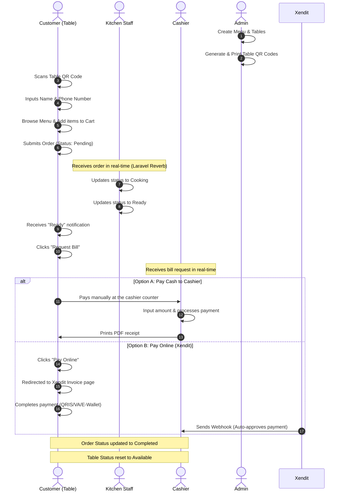

# POS Self-Order System (Self-Ordering Restaurant POS)

[](https://laravel.com)
[](https://vuejs.org)
[](https://tailwindcss.com)
[](https://primevue.org)
[](https://supabase.com)
[](https://www.xendit.co/id/)

A premium, modern, and real-time self-ordering Point of Sale (POS) system designed for restaurants. Customers can scan a table-specific QR code, input their basic information, browse the digital menu, place orders, and choose their preferred payment method. Kitchen staff receive orders in real-time, and cashiers manage active tables and payments dynamically.

---

## 🍽️ System Overview & Goals

The main goal of this system is to streamline the restaurant ordering process, minimize manual errors, and provide a seamless dining experience. By utilizing self-service ordering and real-time updates, we bridge the gap between customers, the kitchen, and the cashier.



---

## 👥 Roles & Key User Flows

### 📱 1. Customer Flow
* **Scan QR Code:** Scanning the table QR code redirects the customer to their table's specific ordering page.
* **Identify & Access:** Customers enter their name and phone number to create a session (order status: `draft`).
* **Interactive Menu & Cart:** Browse categories, customize items with notes, and add them to their interactive cart.
* **Submit Order:** Orders are sent to the kitchen in real-time. Customers can continuously append new items to their active order.
* **Request Bill:** Requesting the bill notifies the cashier instantly.
* **Payment Choice:**
  * **Cash:** Notify cashier to pay manually at the counter.
  * **Online (Xendit):** Instant checkout via QRIS, Virtual Accounts, or E-Wallets.

---

### 🍳 2. Kitchen Flow (Real-time Dashboard) [Route on `/dapur`]
* **Real-time Queue:** View incoming orders automatically as they are submitted (broadcasted via Laravel Reverb).
* **Order Status Transition:** Transition orders from `pending` ➡️ `cooking` ➡️ `ready` with intuitive action buttons.
* **Detailed Info:** View item names, quantities, and customer-specific notes (e.g., "no onions").

---

### 💵 3. Cashier Flow [Route on `/kasir`]
* **Table Grid:** Visual layout displaying all tables, color-coded by occupancy status (`available` vs `occupied`).
* **Real-time Notifications:** Receive distinct visual alerts when a table clicks "Minta Bill" (Request Bill).
* **Manual Checkout:** Select a table, view the itemized summary, input the cash amount received, calculate change, and complete the order.
* **Receipt Generation:** Stream/download print-ready PDF receipts for customers.

---

### ⚙️ 4. Admin Panel [Route on `/admin/menu` and `/admin/reports`]
* **Menu Management:** Full CRUD operations on categories and menu items (with image uploads hosted on Supabase Storage).
* **Table Management:** Manage tables, generate dynamic table-specific QR codes, and download them as PNGs.
* **User Management:** Create and manage user credentials for Cashier, Kitchen, and Admin roles.
* **Financial Reports:** View daily, weekly, or custom date-range sales reports. Export data directly to Excel or download PDF summaries.

---

## ⚡ Tech Stack & Libraries

* **Backend Framework:** Laravel 12 (Core API, Eloquent, Authentication)
* **Frontend Library:** Vue 3 (Composition API) with Inertia.js 2
* **Styling Framework:** Tailwind CSS
* **UI Components:** PrimeVue (using the modern **Aura** preset theme)
* **Real-time Server:** **Laravel Reverb** (WebSockets native broadcasting)
* **Database & Storage:** Supabase (PostgreSQL & Cloud Object Storage)
* **Payment Gateway:** Xendit PHP SDK (QRIS, VA, E-Wallet integration)
* **QR Generator:** Simple QR Code (`simplesoftwareio/simple-qrcode`)
* **Reports & Exports:** Laravel DomPDF & Maatwebsite Excel

---

## 🚀 Quick Setup & Installation

### Prerequisites
* PHP >= 8.2
* Node.js & NPM
* PostgreSQL database (Supabase recommended)

### Step-by-Step Installation

1. **Clone the repository:**
   ```bash
   git clone https://github.com/your-username/pos-self-order-system.git
   cd pos-self-order-system
   ```

2. **Install PHP & JavaScript dependencies:**
   ```bash
   composer install
   npm install
   ```

3. **Configure Environment Variables:**
   Copy the example environment file and fill in your Supabase connection parameters, Laravel Reverb keys, and Xendit API secret.
   ```bash
   cp .env.example .env
   php artisan key:generate
   ```

4. **Run Database Migrations & Seeders:**
   Deploy the tables and seed default users (Admin, Kasir, Dapur) and 10 default tables.
   ```bash
   php artisan migrate --seed
   ```

5. **Start Dev Servers:**
   Launch the Laravel backend server, the Reverb WebSocket server, and the Vite compilation server.

   * **Terminal 1 (Laravel Server):**
     ```bash
     php artisan serve
     ```
   * **Terminal 2 (Reverb WebSockets):**
     ```bash
     php artisan reverb:start
     ```
   * **Terminal 3 (Vite Asset compiler):**
     ```bash
     npm run dev
     ```

6. **Access the App:**
   * Go to `http://localhost:8000/login` to log in as Admin (`admin@pos.com`), Cashier (`kasir@pos.com`), or Kitchen (`dapur@pos.com`) with the password `password`.
   * Scan or browse `http://localhost:8000/order/1` to test the customer flow on Table 1.
